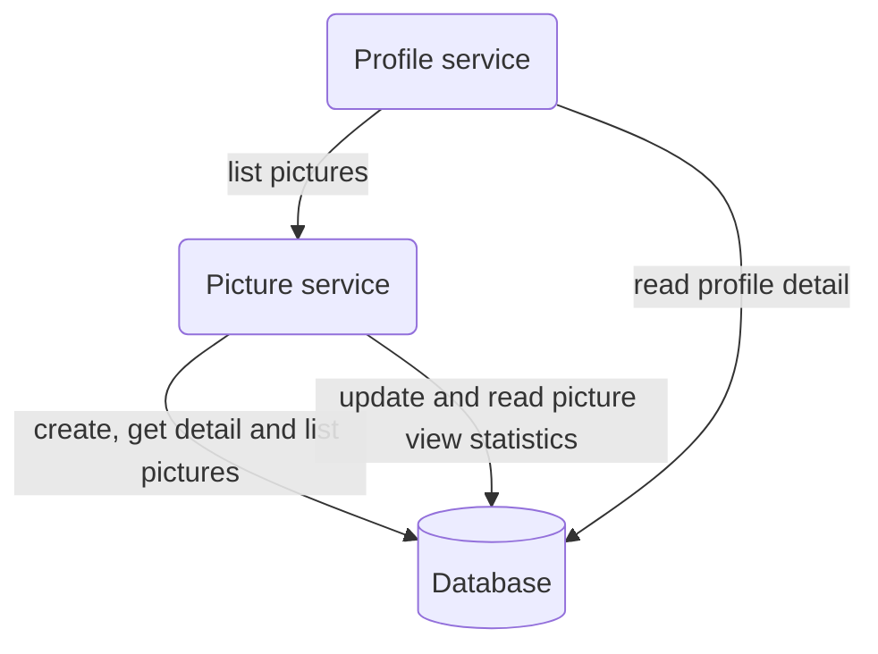

# Integration Testing

## Overview

Application focused on users sharing photos.



### Features

- User profile
- Upload a photo

## Dependencies

- Postgres

## Dockerized Services

This project contains two microservices that have been dockerized:
- `service_profile`: Profile management service
- `service_picture`: Picture management service

### Running the Services

To build and run the services, use the following command:

```bash
docker-compose up -d
```

This will start:
- PostgreSQL database on port 5432
- service_profile on port 8080
- service_picture on port 8081

### Testing services

You can verify that the services are running correctly by accessing their health endpoints:

```bash
# Test service_profile
curl http://localhost:8080/health

# Test service_picture
curl http://localhost:8081/health
```

### Stopping the Services

To stop the services, use:

```bash
docker-compose down
```

## Tools

**Path**: `tools/seeder`

Import csv files into the database. Supports only PostgreSQL DBMS.

The csv file must be named the same as database table and has the `.csv` suffix. For example `1_profiles.csv` will be
imported into `profiles` table.

The tool scans only the first level of directory contents.

**Usage**: `seeder -path seed -uri $DATABASE_URI`
